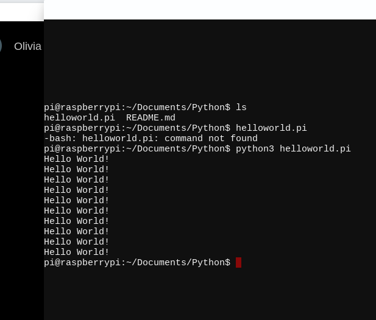
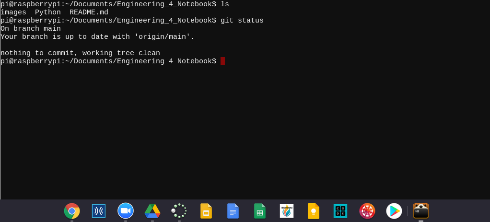
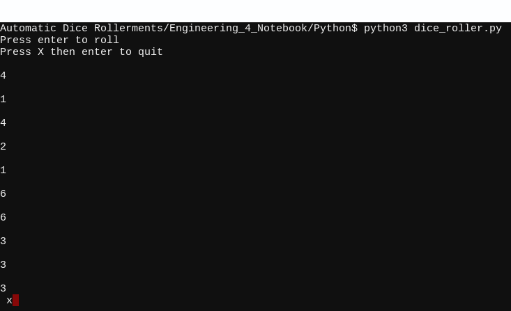
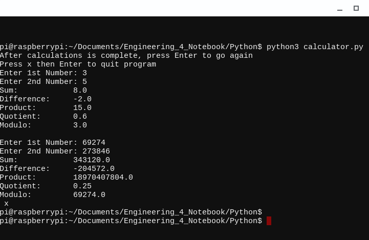
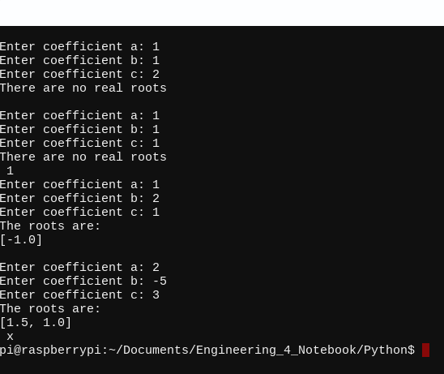
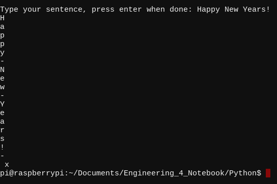
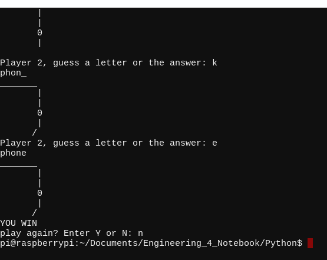
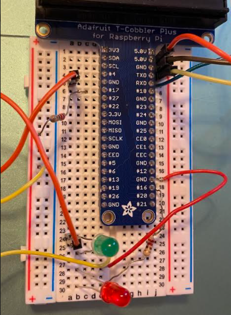
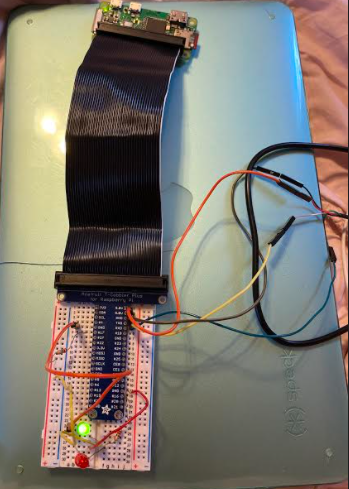

# Python
## Hello Raspberry Pi

### Reflection
This assinemngt made you instal Beagle Term and make it say hello world. Beagle Term was easy to install and reminded me of termux. 
## Get Your Pi Online

### Reflection
I had no problems getting my pi online and connected to my wifi but I had many issues creating the Python folder in my Engineering 4 Notebook Repository. Prior to this assigmnet I had named this repository "Python" instead of Engineering 4 Notebook, so after I got my pi online I went to change the name of the repository so that I could then add my Python folder. This caused a lot of issues, what was shown in git hub and what was shown in Beagle term did not line up, I had an Engineering 4 Notebook within an Engineering 4 Notebook, and i couldn't push my commits. 
## Hello Python

### Reflection
In this assignment I created an automatic dice roller. The user presses enter and a number between 1 and 6 is displayed. Then the user presses x to quit the game. My first big problem was that I created this assigment under the wrong name and then had to re do the assignemnt becasue i didn't know how to change the assignment from dice_roller.pi to dice_roller.py. My other problem was that I forogt to put a colon on while go == "y" and then it wouldn't work.
## Python Program 01 - Calculator

### Reflection
In this assigment I created a calculator that asks the user to enter two numbers and then it adds, subtracts, multiplies, divides, and finds the remainder of the two numbers. The first problem i ran into was that it said my lines that used "operation" were undefined and I didn't know why. It turned out that I had written operations not operation. The next problem i had was that I forogt to use double equal signs on my while and if functions. On this assignment it would have been helpful to be able to copy and paste becasue you are wwriting the same line multiple times with only a small difference so if you could copy and paste then just edit the line you pasted in it would make the assingment much faster, but I do not know how to copy and paste in beagle term.
## Python Program 02 - Quadratic Solver

### Reflection
In this assignment we had to create a program that could solve quadratic equations and find their real roots or say no real roots. It asks the user to enter three variables then it solves the equations and finds the roots. This assigment was similar to the previous one but more challeneging. At first I didn't understand what it mean when it said "an array of the two roots" so i was confused on what the assigment meant. Wikipedia told me that "In computer science, an array data structure, or simply an array, is a data structure consisting of a collection of elements, each identified by at least one array index or key."
## Python Program 03 - Strings and Loops

### Reflection
In this assignment i created a program which has the user type a sentence then it splits the sentence up into arrays and disyplays it one letter per line and with a dash to indicate spaces. To do this i used a split function and a list function. I have had problems committing and pushing my code to github, everytime I try to push the code it fails and i have to do a pull request first and I am not sure why.
## Python Challenge - MSP

### Reflection
In this assignment we created the game Man Sized Piñata, more commonly know as Hangman. The game requires two players, one to type in a word to be guessed and the other to guess the word letter by letter, if they guess incorrectly 9 times the game is over and the guesser loses, if they guess the word correctly before 9 incoreect guesses they win. This was a hard assigment becasue it is so long. The code splits the program into multpiple arrays, one that stores letters, one thats stores blanks for each letter, and one that uses runnum to store the guessed letters. An issue I ran into was that when I guessed a letter corectly instead of deleting the blank space it just put the coreectly guessed letter next to it. To fix this I added blanks[x] = guess, this deleted the 3 undercores that represented the blank and put in the letter guessed.
# Bash
## GPIO Pins - Bash

### Reflection
In this assigment we had to wire up two leds and code it so that the two LEDs alternated and blinked on and off ten times. This was the first time we actually had to wire something up for an assigment which was fun. My biggest problem with the wiring was that i forogt which leg of the leds went to ground. My biggest problem with the code was that I kept getting the error "Invalid Syntax" for my line which said gpio mode 0 out. This was confusing becasue I know had the line typed correctly but it turned out i was still typing python3 to run the code when i should hae been typing bash.
## GPIO Pins - Python

### Reflection
In this assignment we had to do the same as in the last, wire up two leds and code it so that the two LEDs alternated and blinked on and off ten times, but using python not bash. The wiring was exactly the same as the assigment that used bash which made it slightly easier to do. A big differnece in the code was that you use OUTPUT and HIGH and LOW to turn the LEDS on and off in this assigment, this made alot more sense to me becasue this is how we have done it in previous years so I found this code easier that the last where we had to use gpio write.
